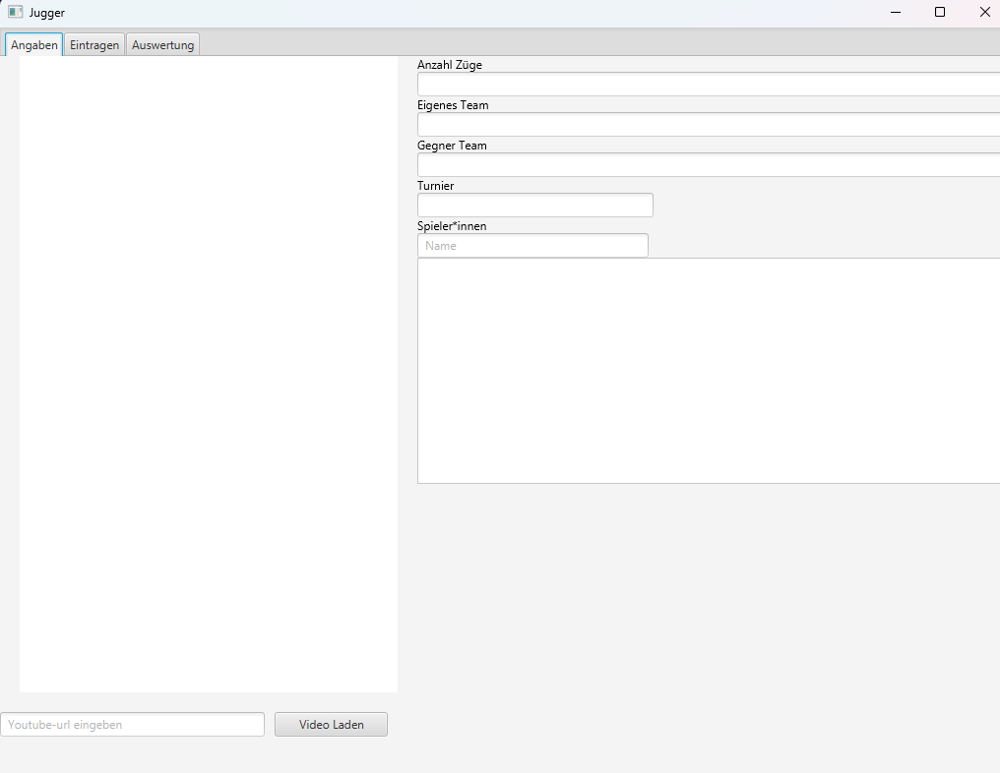
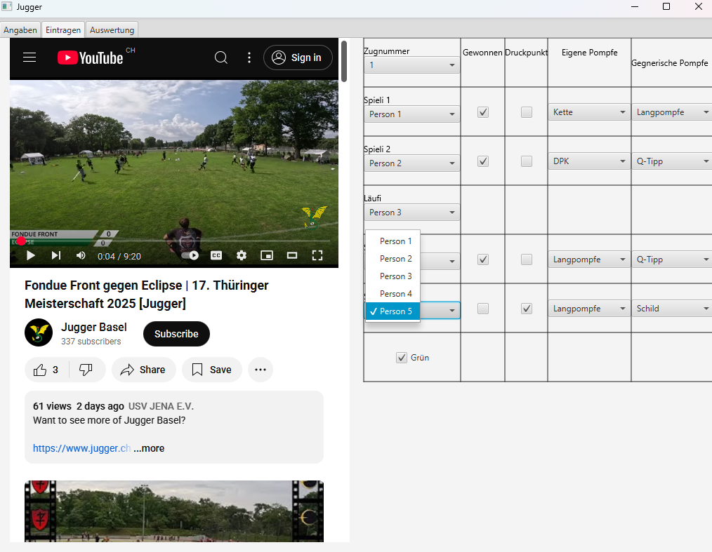
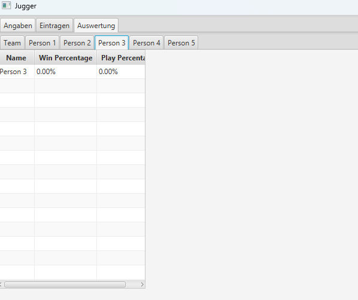

# Jugger-Videotool

Eine Software, die dabei hilft, Daten aus Juggervideos einzutragen, auszuwerten und bestimmte Werte automatisch zu berechnen.  


## Installation

### Voraussetzungen
- Java 17 oder neuer
- Maven installiert (`mvn -v` zum Prüfen)

### Projekt bauen
``` bash
mvn clean package
```

###  Datei ausführen
``` im Terminal
java -jar JuggerVideotool.jar
```
## Verwendung

Nach dem Start des JARs werden Sie gefragt, ob Sie:

1. Eine **vorhandene `.jugger`-Datei** öffnen möchten, oder  
2. Eine **neue Datei** erstellen möchten.

Nachdem Sie Ihre Wahl getroffen haben, öffnet sich ein **neues Fenster**, das aus **drei Tabs** besteht:

---

### Spielinformationen (Erster Tab)


In diesem Tab können alle relevanten Informationen für ein Spiel eingegeben werden:

- **Turniername**  
- **Eigenes Team**  
- **Gegnerisches Team**  
- **Anzahl Züge**  
- **YouTube-Link** für das Video  
- **Namen aller Spieler*innen**

---

###  Zugdaten (Zweiter Tab)


Hier werden die Informationen für jeden Zug eingetragen:

- **Namen der fünf Spieler*innen**  
- **Pompfen für alle Spieler*innen** (außer Läufer*innen)  
- **Ist es ein Druckpunkt?**  
- **Wurde das Duell gewonnen?**  
- **Gegnerische Pompfen**  
- **Hatte das eigene Team grün?**

---

### Auswertung (Dritter Tab)


In diesem Tab werden die Daten ausgewertet und automatisch berechnet:

- **Prozentualer Anteil an Grün für das Team**  
- **Für jede Person ein eigener Tab, indem die Gewinnrate und Spielzeit berechnet wird**


## Lizenz
[MIT License](/LICENSE)


Copyright (c) 2025 Mael Pittet


